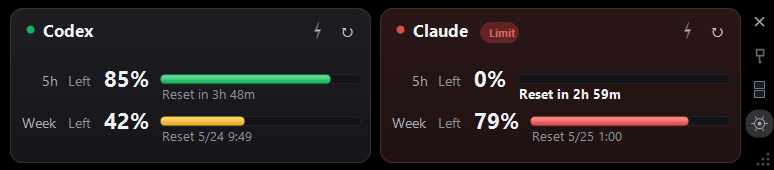

[English](README.md) · [**日本語**]

# Headroom

Claude と Codex の上限までの余裕（headroom）をひと目で確認できる、Windows 用の常時表示ウィジェットです。

## できること

- **2サービスを同時表示** — Claude と Codex の 5時間枠・週間枠を、ひとつの常時最前面ウィジェットでまとめて確認
- **表示の自由度** — サービスごとに残量/使用量を切り替え、横並び/縦並び、リセットを残り時間/リセット時刻のいずれかで表示
- **残量警告と上限到達表示** — 残量がしきい値を下回るとバーが黄→赤に変化し、上限到達時はバッジと警告色で表示

## 使い方

1. Releases から `Headroom.zip` をダウンロードして任意の場所に解凍
2. `Headroom.exe` を実行
3. 初回のみ、各カードの **ログイン** ボタンを押して Claude / Codex にログイン。セッションはローカルに保存され、次回以降は自動取得

> WebView2 ランタイムが必要です（Windows 11 と最近の Windows 10 にはプリインストール済み）。

## 画面

### 両サービス・横並び（デフォルト）


### 片サービスのみ


設定の **一般** から片方を無効にすると、1枚カードに収まります。

### 縦並びレイアウト


サイドレールのレイアウトボタン、または **設定 → レイアウト** で切り替えできます。

### 表示モード


各サービスごとに **残量 / 使用量** を切り替え可能。リセット時刻は「残り時間」と「リセット時刻」を、5時間枠と週間枠で独立に設定できます。Claude / Codex の元ページで表記が違っていても、内部で日時に変換するため形式が揃います。

### 上限到達



上限に達した枠はカード全体の警告色と `Limit` バッジで強調され、ひと目で状態が分かります。

## ボタン

| ボタン | 機能 |
|--------|------|
| ↻ | 今すぐ手動更新 |
| ⚡ | ブースト — 30分間、1分間隔で更新 |
| × | 閉じる |
| 📌 | 最前面に固定 / 解除 |
| ⇆ | 横並び / 縦並び 切り替え |
| ⚙ | 設定を開く |

## 設定

サイドレールの ⚙ から開きます。

- **一般** — 言語、最前面固定、各サービスの有効/無効
- **レイアウト** — 配置、サービスごとの残量/使用量、枠ごとのリセット形式
- **更新** — 通常更新間隔（デフォルト15分）、ブースト時間・間隔（デフォルト30分/1分）
- **閾値** — 黄色になる残量（デフォルト50%）、赤になる残量（デフォルト30%）

## 仕組み

非表示の WebView2 を 2つ Claude / Codex の使用量ページに向け、レンダリングされたテキストをパースして、自前のダーク UI で描画しています。ログインセッションは `%LOCALAPPDATA%\Headroom\` 以下の WebView2 ユーザーデータに保存され、認証情報は外部に送信されません。旧 `AiUsageWebView2` ビルドのセッションは初回起動時に自動で引き継ぎます。

## ソースからビルド

```powershell
.\build.ps1
```

Windows と .NET Framework 4 が必要です（`build.ps1` 内で csc.exe のパスをハードコード）。WebView2 の NuGet パッケージは初回ビルド時に自動取得されます。
