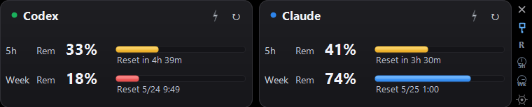
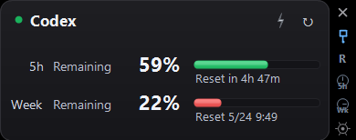
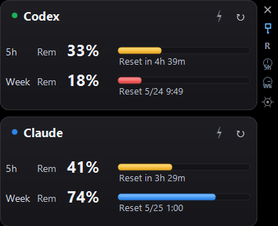
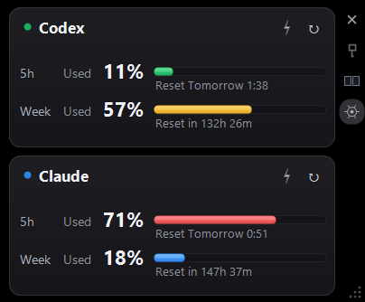
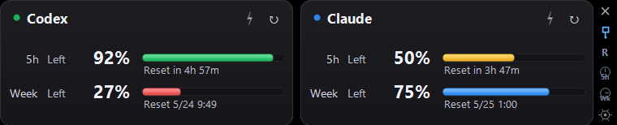
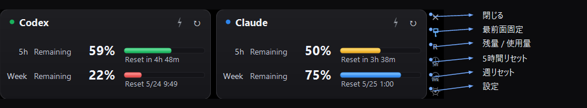

[English](README.md) · [**日本語**]

# Headroom

[](https://github.com/tesuheee/headroom)
[](https://learn.microsoft.com/dotnet/csharp/)
[](LICENSE)

Claude と Codex の上限までの余裕（headroom）をひと目で確認できる、Windows 用の小さなデスクトップウィジェットです。

## できること

- **2サービスを同時表示** — Claude と Codex の 5時間枠・週間枠を、ひとつのフローティングウィジェットでまとめて確認
- **表示の自由度** — サービスごとに残量/使用量を切り替え、横並び/縦並び、リセットを残り時間/リセット時刻のいずれかで表示
- **残量警告** — 残量がしきい値を下回ると、枠ごとのバーが黄→赤に変化
- **アカウント管理** — 設定ダイアログから Claude / Codex のログイン・ログアウトを管理

## 使い方

1. [Releases](https://github.com/tesuheee/headroom/releases) から最新版の `Headroom-vX.Y.Z.zip` をダウンロードして任意の場所に解凍
2. `Headroom.exe` を実行
3. 初回のみ、各カードの **ログイン** ボタンを押すとターミナルが開きます。
   - **Claude**：`/login` と入力してブラウザのサインインフローに従う
   - **Codex**：`codex login` のブラウザフローが自動で始まる
   セッションは **設定 → アカウント** からも管理できます。

## 画面

### 両サービス・横並び（デフォルト）



### 片サービスのみ



設定の **一般** から片方を無効にすると、1枚カードに収まります。

### 縦並びレイアウト



**設定 → レイアウト** で横並び / 縦並びを切り替えできます。

### 表示モード



各サービスごとに **残量 / 使用量** を切り替え可能。リセット時刻は「残り時間」と「リセット時刻」を、5時間枠と週間枠で独立に設定できます。Claude / Codex の元ページで表記が違っていても、内部で日時に変換するため形式が揃います。

### 色しきい値



各枠のバーは個別に色分けされます。通常はサービス色、警告域は黄色、危険域は赤で表示します。上限に達した場合は、対象カードに `Limit` バッジも表示されます。

## ボタン



| サイドバー操作 | 機能 |
|----------------|------|
| × | 閉じる |
| ピン | 最前面固定 / 解除 |
| R / U | 表示中サービスの残量 / 使用量を切り替え |
| 5h | 5時間リセット表示を残り時間 / 時刻で切り替え |
| Wk | 週リセット表示を残り時間 / 時刻で切り替え |
| ⚙ | 設定を開く |

サービスごとのボタン:

| ボタン | 機能 |
|--------|------|
| ↻ | サービスを今すぐ更新 |
| ⚡ | ブースト — 30分間、1分間隔で更新 |

## 設定

サイドレールの ⚙ から開きます。

- **一般** — 言語、最前面固定、各サービスの有効/無効
- **アカウント** — Claude / Codex のログイン・ログアウト
- **レイアウト** — 配置、サービスごとの残量/使用量、枠ごとのリセット形式
- **更新** — 通常更新間隔（デフォルト15分）、ブースト時間・間隔（デフォルト30分/1分）
- **閾値** — 黄色になる残量（デフォルト50%）、赤になる残量（デフォルト30%）

## 仕組み

`%USERPROFILE%\.claude\.credentials.json`（Claude）と `%USERPROFILE%\.codex\auth.json`（Codex）
から OAuth トークンを読み取り、各 API を直接呼び出して自前のダーク UI で描画します。
認証情報の書き込みは Claude Code CLI / Codex CLI が行い、Headroom は読み取るだけです。
設定は `%LOCALAPPDATA%\Headroom\settings.json` に保存されます。

## フィクスチャモード

実際の利用枠を消費せずに見た目を確認する場合は、フィクスチャフォルダを指定して起動します。

```powershell
.\build.ps1 -DebugFixture
.\debug\Headroom.fixture.exe --fixture .\docs\fixtures\03-weekly-exhausted
```

フォルダには本番 API レスポンスと同じ形の `claude.json` / `codex.json` を置きます。
Headroom はこの2ファイルを監視し、編集されると自動で再描画します。
サンプルは `docs/fixtures/` にあります。

## ソースからビルド

```powershell
.\build.ps1
```

Windows と .NET Framework 4 が必要です（`build.ps1` 内で csc.exe のパスをハードコード）。

リリース用zipを作る場合:

```powershell
.\build.ps1 -Version 2.0.0
```

`releases/Headroom-vX.Y.Z.zip` に出力されます。
