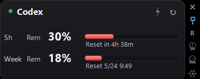
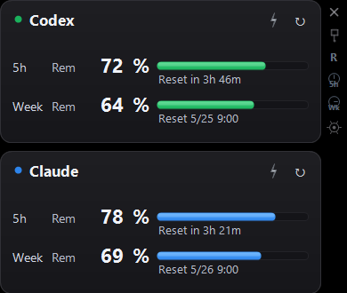
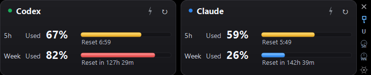
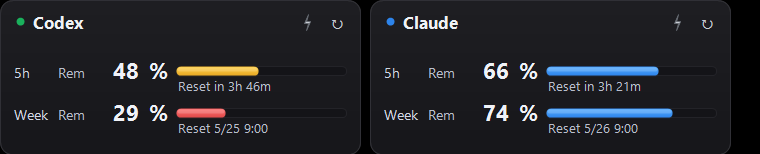
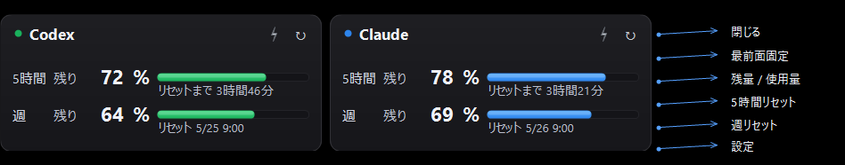

[English](README.md) · [**日本語**]

# Headroom — Claude Code & Codex 向け AI 使用量モニター


[](https://github.com/tesuheee/headroom-ai-usage-monitor)
[](https://learn.microsoft.com/dotnet/csharp/)
[](LICENSE)

Headroom は Claude Code と Codex の AI 使用量・残量・リセット時刻・ログイン状態を常時表示する、Windows 用の小さなデスクトップウィジェットです。

## できること

- **2サービスを同時モニター** — Claude Code と Codex の 5時間枠・週間枠を、ひとつのフローティングウィジェットでまとめて確認
- **表示の自由度** — サービスごとに残量/使用量を切り替え、横並び/縦並び、Claude / Codex の表示順、リセットを残り時間/リセット時刻のいずれかで表示
- **残量警告** — 残量がしきい値を下回ると、枠ごとのバーが黄→赤に変化
- **アカウント管理** — 設定ダイアログから Claude / Codex のログイン・ログアウトを管理
- **OAuth 状態に追従** — CLI 互換の認証ファイルを読み取り、トークン更新や API のレート制限待機にも対応

## 使い方

1. [Releases](https://github.com/tesuheee/headroom-ai-usage-monitor/releases) から最新版の `Headroom-vX.Y.Z.zip` をダウンロードして任意の場所に解凍
2. `Headroom.exe` を実行
3. 初回のみ、各カードの **ログイン** ボタンを押します。
   - デフォルトでは Headroom 内蔵のブラウザ OAuth フローを使います。サインインするとタブに「ログイン完了」と表示され、Headroom が自動的に認証情報を取り込みます。
   - **設定 → アカウント** から、サービスごとに **ブラウザOAuth** / **CLI** / **自動** を選べます。自動は CLI があれば CLI、なければブラウザ OAuth を使います。
   - Claude CLI ログインでは開いたターミナルで `/login` を入力します。Codex CLI は `codex login` を直接起動します。
   セッションのログアウトも **設定 → アカウント** から管理できます。

## 画面

### 両サービス・横並び（デフォルト）


### 片サービスのみ



設定の **一般** から片方を無効にすると、1枚カードに収まります。

### 縦並びレイアウト



**設定 → レイアウト** で横並び / 縦並びと Claude / Codex の表示順を切り替えできます。

### 表示モード



各サービスごとに **残量 / 使用量** を切り替え可能。リセット時刻は「残り時間」と「リセット時刻」を、5時間枠と週間枠で独立に設定できます。Claude / Codex の元ページで表記が違っていても、内部で日時に変換するため形式が揃います。

### 色しきい値



各枠のバーは個別に色分けされます。通常はサービス色、警告域は黄色、危険域は赤で表示します。上限に達した場合は、対象カードに `Limit` バッジも表示されます。

## ボタン



| サイドバー操作 | 機能 |
|----------------|------|
| × | 閉じる |
| ピン | 最前面固定 / 解除 |
| R / U | 表示中サービスの残量 / 使用量を切り替え |
| 5h | 5時間リセット表示を残り時間 / 時刻で切り替え |
| Wk | 週リセット表示を残り時間 / 時刻で切り替え |
| ⚙ | 設定を開く |

サービスごとのボタン:

| ボタン | 機能 |
|--------|------|
| ↻ | サービスを今すぐ更新 |
| ⚡ | ブースト — 30分間、1分間隔で更新 |

## 設定

サイドレールの ⚙ から開きます。

- **一般** — 言語、最前面固定、各サービスの有効/無効
- **アカウント** — Claude / Codex のログイン・ログアウト、サービスごとのログイン方法（ブラウザOAuth / CLI / 自動）
- **レイアウト** — 配置、サービスの表示順、サービスごとの残量/使用量、枠ごとのリセット形式
- **更新** — 通常更新間隔（デフォルト15分）、ブースト時間・間隔（デフォルト30分/1分）
- **閾値** — 黄色になる残量（デフォルト50%）、赤になる残量（デフォルト30%）

## 仕組み

`%USERPROFILE%\.claude\.credentials.json`（Claude Code）と `%USERPROFILE%\.codex\auth.json`（Codex）
から OAuth トークンを読み取り、各 API を直接呼び出して自前のダーク UI で描画します。
ログイン方法はサービスごとに選択できます。ブラウザOAuthは Headroom 自身の PKCE フロー
（システムブラウザ + localhost コールバック）、CLI はインストール済み CLI のログインフロー、
自動は従来どおり CLI 優先です。リフレッシュトークンを使ってアクセストークンを自動で
更新し続け、429 応答では短い間隔で叩き続けずバックオフします。
設定は `%LOCALAPPDATA%\Headroom\settings.json` に保存されます。

## フィクスチャモード

実際の利用枠を消費せずに見た目を確認する場合は、フィクスチャフォルダを指定して起動します。

```powershell
.\build.ps1 -DebugFixture
.\debug\Headroom.fixture.exe --fixture .\docs\fixtures\03-weekly-exhausted
```

フォルダには本番 API レスポンスと同じ形の `claude.json` / `codex.json` を置きます。
Headroom はこの2ファイルを監視し、編集されると自動で再描画します。

## ソースからビルド

```powershell
.\build.ps1
```

Windows と .NET Framework 4 が必要です（`build.ps1` 内で MSBuild.exe のパスをハードコード）。

リリース用zipを作る場合:

```powershell
.\build.ps1 -Version 2.0.0
```

`releases/Headroom-vX.Y.Z.zip` に出力されます。`-Version` の値は exe のバージョン情報と設定画面のバージョン表示にも入ります。通常の `.\build.ps1` で作るローカルビルドは `dev` と表示します。
