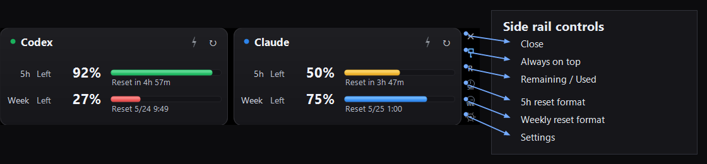

[**English**] · [日本語](README.ja.md)

# Headroom

[](https://github.com/tesuheee/headroom)
[](https://dotnet.microsoft.com/)
[](https://learn.microsoft.com/dotnet/csharp/)
[](LICENSE)
[](https://github.com/tesuheee/headroom/releases/latest)

A compact Windows desktop widget that shows how much Claude and Codex quota headroom you have left.

## Features

- **Side-by-side monitoring** — Claude and Codex, both 5-hour and weekly quotas, in one floating widget
- **Flexible display** — per-service Remaining / Used switch, wide or tall layout, reset shown as countdown or clock time
- **Low-quota warnings** — each quota row turns yellow or red at configurable thresholds
- **Account controls** — log in or log out of Claude / Codex from the embedded browser session

## Getting Started

1. Download the latest versioned `Headroom-vX.Y.Z.zip` from [Releases](https://github.com/tesuheee/headroom/releases) and unzip anywhere.
2. Run `Headroom.exe`.
3. On first launch, click **Login** on each card and sign in to Claude / Codex through the embedded browser. You can also manage sessions from **Settings → Account**.

> Requires the WebView2 Runtime (preinstalled on Windows 11 and recent Windows 10).

## Screens

### Both services, horizontal (default)


### Single service


Disable a service from **Settings → General** to compact down to one card.

### Vertical layout


Switch between wide and tall layouts from **Settings → Layout**.

### Display modes


Each service has its own **Remaining / Used** switch. Reset can be a countdown ("3h 53m left") or an absolute clock time ("5/25 0:59"), set independently for 5-hour and weekly. Different phrasings on Claude and Codex pages are normalized so the format stays consistent.

### Color thresholds


Each quota row is colored independently: normal rows use the service color, warning rows turn yellow, and critical rows turn red. If a quota is exhausted, the affected card also shows a `Limit` badge.

## Buttons



| Side rail control | Action |
|-------------------|--------|
| × | Close |
| Pin | Toggle always on top |
| R / U | Toggle Rem / Used for visible services |
| 5h | Toggle 5-hour reset between countdown and clock time |
| Wk | Toggle weekly reset between countdown and clock time |
| ⚙ | Open settings |

Per-service buttons:

| Button | Action |
|--------|--------|
| ↻ | Refresh one service now |
| ⚡ | Boost one service — refresh every minute for 30 minutes |

## Settings

Open with the ⚙ icon on the side rail.

- **General** — language, always on top, enable/disable each service
- **Account** — login/logout controls for Claude and Codex
- **Layout** — arrangement, per-service remaining/used, per-quota reset format
- **Refresh** — normal interval (15 min default), Boost duration / interval (30 min / 1 min default)
- **Thresholds** — yellow at 50%, red at 30% (configurable)

## How it works

The app hosts two hidden WebView2 instances pointed at the Claude and Codex usage pages, parses the rendered text, and renders a custom dark UI. Login sessions live in the WebView2 user-data folder under `%LOCALAPPDATA%\Headroom\`; credentials are not sent anywhere else. Existing sessions from older `AiUsageWebView2` builds are copied forward automatically on first launch.

## Build from source

```powershell
.\build.ps1
```

Windows + .NET Framework 4 required (csc.exe path is hard-coded in `build.ps1`). The WebView2 NuGet package is fetched on first build.

To create a release archive:

```powershell
.\build.ps1 -Version 1.3.6
```

The archive is written to `releases/Headroom-vX.Y.Z.zip`.
