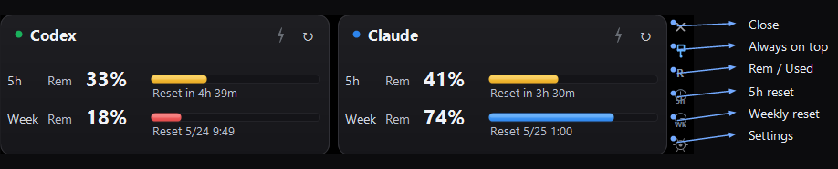

[**English**] · [日本語](README.ja.md)

# Headroom — AI Usage Monitor for Claude Code & Codex


[](https://github.com/tesuheee/headroom-ai-usage-monitor)
[](https://learn.microsoft.com/dotnet/csharp/)
[](LICENSE)

Headroom is a compact Windows desktop AI usage monitor for Claude Code and Codex. It shows remaining quota, used quota, reset times, login state, and rate-limit status in a small always-on-top widget.

## Features

- **Side-by-side usage monitoring** — Claude Code and Codex, both 5-hour and weekly quotas, in one floating widget
- **Flexible display** — per-service Remaining / Used switch, wide or tall layout, Claude / Codex service order, reset shown as countdown or clock time
- **Low-quota warnings** — each quota row turns yellow or red at configurable thresholds
- **Account controls** — log in or log out of Claude Code / Codex from the Settings dialog
- **OAuth-aware status** — reads CLI-compatible credentials, refreshes tokens, and backs off when the usage API returns rate limits

## Requirements

Runtime:

- 64-bit Windows 10 or Windows 11.
- .NET Framework 4.8 or later. Windows 10 22H2 and Windows 11 include a compatible .NET Framework 4.x runtime.
- The release zip does not require the .NET Framework Developer Pack.

Source builds:

- Windows PowerShell or PowerShell 7.
- .NET Framework 4.8 Developer Pack, or Visual Studio Build Tools with the .NET Framework 4.8 targeting pack.
- `build.ps1` intentionally uses `C:\Windows\Microsoft.NET\Framework64\v4.0.30319\MSBuild.exe`; that is the shared CLR 4 toolchain path for .NET Framework 4.x, not a .NET Framework 4.0 target.

Install the build prerequisites with winget:

```powershell
winget install --id Microsoft.DotNet.Framework.DeveloperPack_4 --version 4.8 --source winget
```

## Getting Started

1. Download the latest versioned `Headroom-vX.Y.Z.zip` from [Releases](https://github.com/tesuheee/headroom-ai-usage-monitor/releases) and unzip anywhere.
2. Run `Headroom.exe`.
3. On first launch, click **Login** on each card.
   - By default, Headroom uses its built-in Browser OAuth flow. After signing in, the tab shows "Login complete" and Headroom picks up the new credentials automatically.
   - You can switch each service to **CLI** or **Auto** from **Settings → Account**. Auto uses the CLI when available and falls back to Browser OAuth.
   - For Claude CLI login, type `/login` in the opened terminal. Codex CLI starts `codex login` directly.
   You can also log out and manage sessions from **Settings → Account**.

## Screens

### Both services, horizontal (default)


### Single service


Disable a service from **Settings → General** to compact down to one card.

### Vertical layout


Switch between wide and tall layouts and choose the Claude / Codex service order from **Settings → Layout**.

### Display modes


Each service has its own **Remaining / Used** switch. Reset can be a countdown ("3h 53m left") or an absolute clock time ("5/25 0:59"), set independently for 5-hour and weekly. Different phrasings on Claude and Codex pages are normalized so the format stays consistent.

### Color thresholds


Each quota row is colored independently: normal rows use the service color, warning rows turn yellow, and critical rows turn red. If a quota is exhausted, the affected card also shows a `Limit` badge.

## Buttons



| Side rail control | Action |
|-------------------|--------|
| × | Close |
| Pin | Toggle always on top |
| R / U | Toggle Rem / Used for visible services |
| 5h | Toggle 5-hour reset between countdown and clock time |
| Wk | Toggle weekly reset between countdown and clock time |
| ⚙ | Open settings |

Per-service buttons:

| Button | Action |
|--------|--------|
| ↻ | Refresh one service now |
| ⚡ | Boost one service — refresh every minute for 30 minutes |

## Settings

Open with the ⚙ icon on the side rail.

- **General** — language, always on top, enable/disable each service
- **Account** — login/logout controls and per-service login method (Browser OAuth / CLI / Auto)
- **Layout** — arrangement, service order, per-service remaining/used, per-quota reset format
- **Refresh** — normal interval (15 min default), Boost duration / interval (30 min / 1 min default)
- **Thresholds** — yellow at 50%, red at 30% (configurable)

## How it works

The app reads OAuth tokens from `%USERPROFILE%\.claude\.credentials.json` (Claude Code) and
`%USERPROFILE%\.codex\auth.json` (Codex), calls the respective usage APIs directly, and
renders a custom dark UI. Login method is configurable per service: Browser OAuth uses
Headroom's PKCE flow (system browser + localhost callback), CLI launches the installed
Claude/Codex CLI, and Auto preserves the old CLI-when-available behavior. Refresh tokens are used to keep
the access token alive without re-login, and 429 responses trigger a backoff instead of retrying in a tight loop. Settings are stored in
`%LOCALAPPDATA%\Headroom\settings.json`.

## Fixture mode

For UI verification without spending quota, start Headroom with a fixture folder:

```powershell
.\build.ps1 -DebugFixture
.\debug\Headroom.fixture.exe --fixture .\docs\fixtures\03-weekly-exhausted
```

The folder must contain `claude.json` and `codex.json` in the same shape as the live API
responses. Headroom watches those files and refreshes automatically when they change.

## Build and Test from Source

```powershell
.\build.ps1
```

Run the parser/settings tests:

```powershell
.\tests\run-tests.ps1
```

Build the fixture binary for UI verification:

```powershell
.\build.ps1 -DebugFixture
```

If `build.ps1` reports that .NET Framework 4.8 reference assemblies are missing,
install the .NET Framework 4.8 Developer Pack. This is only required for building
from source; it is not required to run the released `Headroom.exe`.

To create a release archive:

```powershell
.\build.ps1 -Version 2.0.0
```

The archive is written to `releases/Headroom-vX.Y.Z.zip`. The `-Version` value is embedded in the exe version metadata and shown in Settings. Plain local `.\build.ps1` builds show `dev`.
