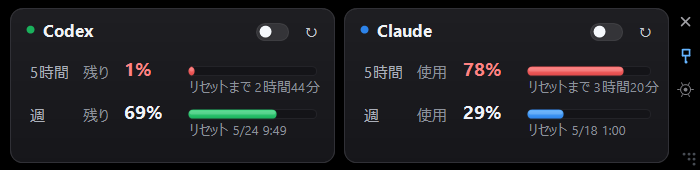

# AI Usage WebView2 Portable

Claude と Codex の使用量を、小さい常時表示ウィンドウで見るための Windows アプリです。
Microsoft Edge WebView2 で各サービスの使用量ページを読み取り、コンパクトな表示にまとめます。



## 表示内容

- `Codex` と `Claude` の使用量を横並びで表示します。
- `5時間` は短期の利用枠、`週` は週次の利用枠です。
- パーセンテージは、設定から `残量表示` / `使用量表示` を切り替えられます。
- 5時間枠は `リセットまで 4時間25分` のように残り時間で表示します。
- 週次枠は `リセット 5/24 9:49` のように日付と時刻で表示します。
- 残量が少ないとバーの色が黄色・赤に変わります。しきい値と色は設定できます。
- 右側の縦アイコンから、閉じる・最前面固定・設定・リサイズができます。

## 起動

`Start.bat` を実行してください。
直接起動する場合は `bin\AiUsageWebView2.exe` でも動きます。

初回はログインが必要です。使用量が取得できない場合は、アプリ内の `ログイン` ボタンから Claude / Codex にログインしてください。

## 設定

設定画面では、主に以下を変更できます。

- 通常更新間隔
- ブースト更新の時間と間隔
- リセット直前の自動高頻度更新
- Codex / Claude の `残量表示` / `使用量表示`
- 文字サイズ
- 黄色・赤に変わる残量しきい値
- 最前面固定

ログイン情報は各PCの `%LOCALAPPDATA%\AiUsageWebView2\WebView2Profile` に保存されます。

## 別PCへ移す

このフォルダごとコピーしてください。最低限必要なのは以下です。

- `Start.bat`
- `bin\AiUsageWebView2.exe`
- `bin\*.dll`
- `bin\settings.json`

コピー先PCにも Microsoft Edge WebView2 Runtime が必要です。通常の Windows では既に入っていることが多いです。

## ビルド

開発・再ビルドする場合は以下を実行します。

```powershell
powershell -NoProfile -ExecutionPolicy Bypass -File .\build.ps1
```

必要に応じて WebView2 の NuGet パッケージを `packages\` にダウンロードします。
