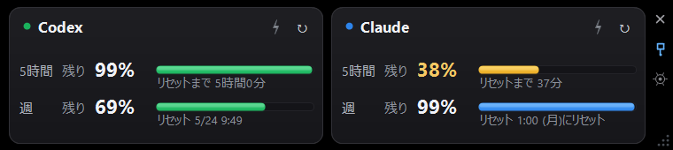

# Claude / Codex 使用量モニター

Claude と Codex のWeb使用量ページを読み取り、デスクトップに常時表示する Windows アプリです。

## できること

- Claude と Codex の使用状況を同じ画面で確認できます
- 5時間枠と週間枠の残り具合をひと目で把握できます
- 残量と使用量のどちらを見るか、自分の見方に合わせて選べます
- 表示するサービスや並べ方を作業環境に合わせて選べます
- 上限が近いサービスに気づきやすくなります

## 使い方

`AiUsageWebView2.exe` をダブルクリックして起動します。

初回のみ、各カードの「ログイン」ボタンを押して Claude と Codex にログインしてください。一度ログインすれば次回以降は自動で取得されます。

## ボタン

| ボタン | 機能 |
|--------|------|
| ⚡ | ブースト（1分間隔の高頻度更新、30分間） |
| ↻ | 今すぐ手動更新 |
| × | 閉じる |
| 📌 | 最前面固定のON/OFF |
| ⚙ | 設定を開く |

各ボタンにカーソルを合わせるとツールチップが表示されます。

## 設定

右端の ⚙ アイコンから開けます。

| 項目 | 初期値 |
|------|--------|
| 通常更新間隔 | 15分 |
| ブースト時間 | 30分 |
| ブースト更新間隔 | 1分 |
| リセット直前の自動切替 | 15分前 |
| リセット直前の更新間隔 | 1分 |
| 表示サービス | Claude / Codex |
| 配置 | 横 |
| 表示モード（残量 / 使用量） | 残量 |
| 5時間リセット表示（残り時間 / リセット時刻） | リセット時刻 |
| 週リセット表示（残り時間 / リセット時刻） | リセット時刻 |
| 黄色になる残量 | 50% |
| 赤になる残量 | 30% |
| 文字サイズ | — |
| 言語 | 日本語 |
| 最前面に固定 | ON |

リセット表示は、Claude と Codex の元ページで表記が違っていても、アプリ側で日時に変換してから設定に従って表示します。
